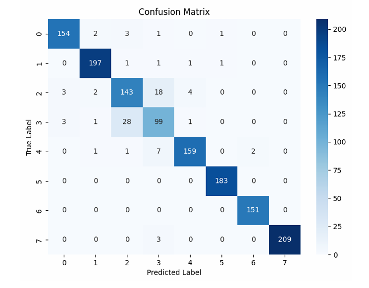

# 📸 Natural Images Classification Project

This project was developed as part of the "Deep Learning and NLP" course at Ariel University (2025).  
It focuses on designing, training, and evaluating different machine learning and deep learning models to classify images from the **Natural Images** dataset.

---

## 📚 Dataset Overview

The **Natural Images** dataset includes **6,899 images** across 8 categories:  
**airplane**, **car**, **cat**, **dog**, **flower**, **fruit**, **motorbike**, and **person**.

### Distribution of Images

- Images were resized to **128x128** pixels.
- Normalized pixel values to the range [0,1].
- Applied data augmentation for CNN and VGG models.

---

## 💡 Models and Methodology

We explored multiple modeling approaches:

### 1. Baseline: Dummy Classifier
- Predicts the most frequent class.
- Achieved accuracy: **13%** (benchmark only).

### 2. Logistic Regression Classifier
- Multi-class softmax logistic regression.
- Achieved accuracy: **71.7%**.

**Confusion Matrix:**

---

### 3. Fully Connected Neural Network (FCNN)
- Designed with 4 hidden layers and ReLU activations.
- Implemented early stopping based on validation loss.
- Achieved accuracy: **80%**.

**Architecture:**

**Confusion Matrix:**

**Training and Validation Loss:**

---

### 4. Convolutional Neural Network (CNN)
- Custom CNN architecture with batch normalization, dropout, and data augmentation.
- Achieved accuracy: **94.8%**.

**Confusion Matrix:**

---

### 5. Pre-trained VGG16 Fine-Tuning
- Fine-tuned VGG16 model pretrained on ImageNet.
- Achieved final test accuracy: **~99%**.
- Applied aggressive data augmentation for robustness.

---

## 🔄 Technologies Used

- **Python**
- **PyTorch**
- **Scikit-learn**
- **Torchvision**
- **Pandas**, **Numpy**
- **Matplotlib**, **Seaborn**

---

## 📊 Summary of Results

| Model | Accuracy |
|:-----|:--------|
| Dummy Classifier | 13% |
| Logistic Regression (Softmax) | 71.7% |
| FCNN | 80% |
| CNN | 94.8% |
| VGG16 (Fine-Tuned) | ~99% |

---

## 🚀 Future Work

- Exploring other pretrained architectures (ResNet, EfficientNet).
- Hyperparameter tuning (learning rate schedulers, optimizers).
- Extending dataset diversity and applying transfer learning.

---

## 👋 Team

- **Hila Shamir**
- **Ayelet Katkov**

---

> **Note:** All code, models, and further project details can be found in this repository.
